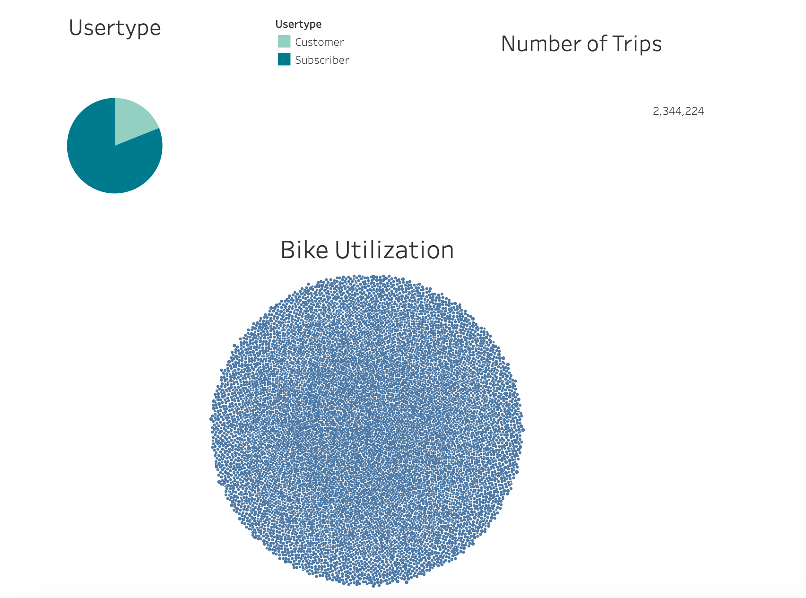
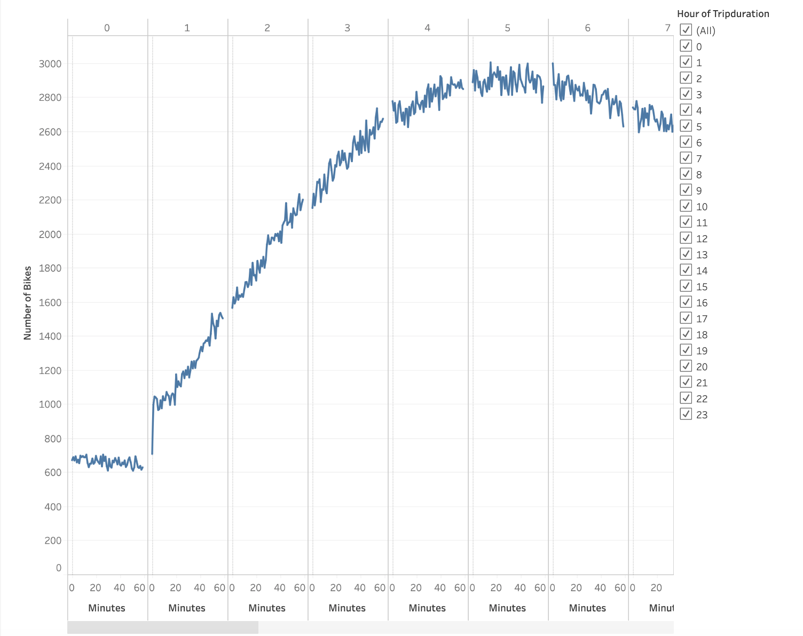
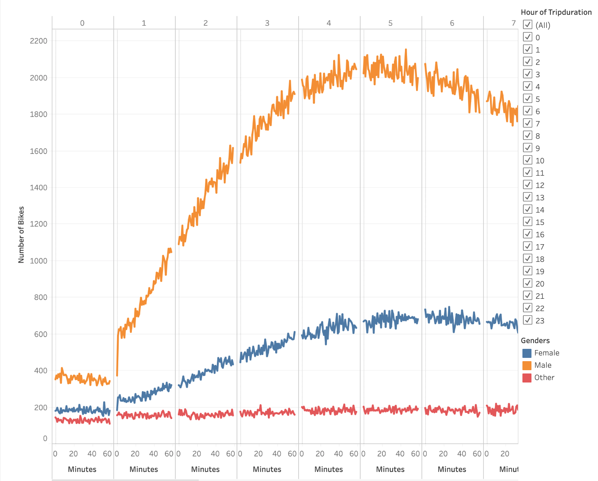
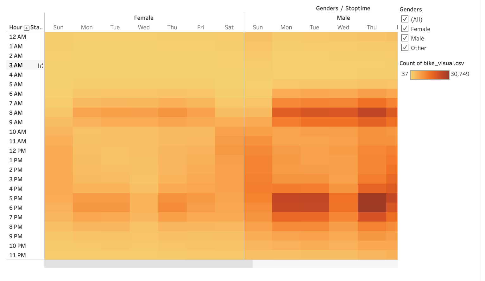
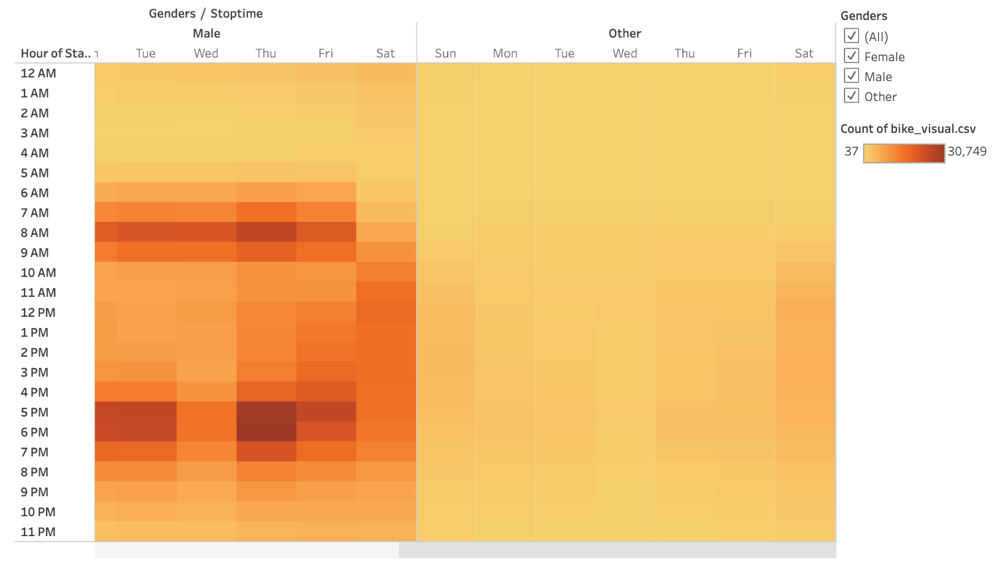
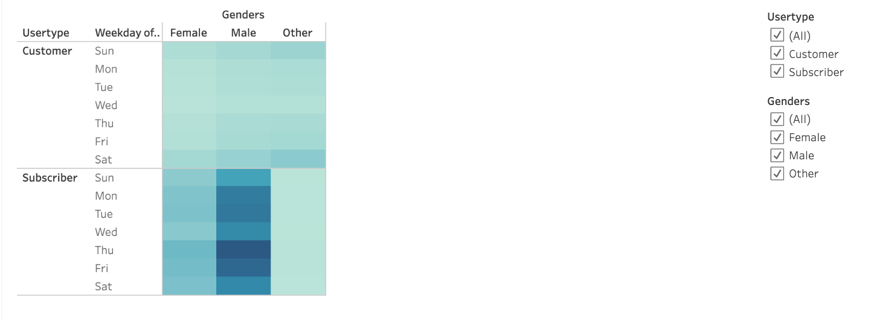
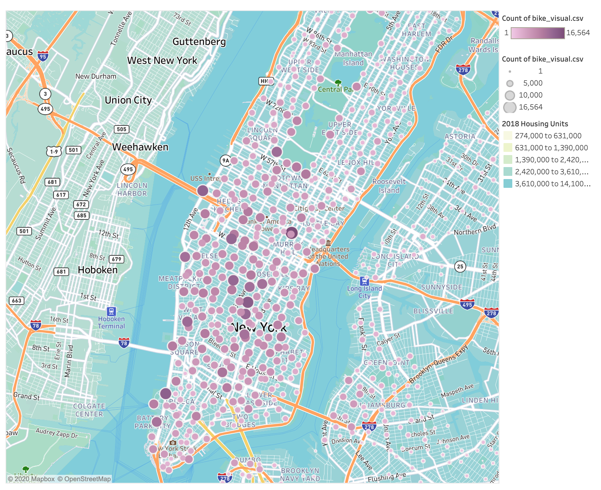
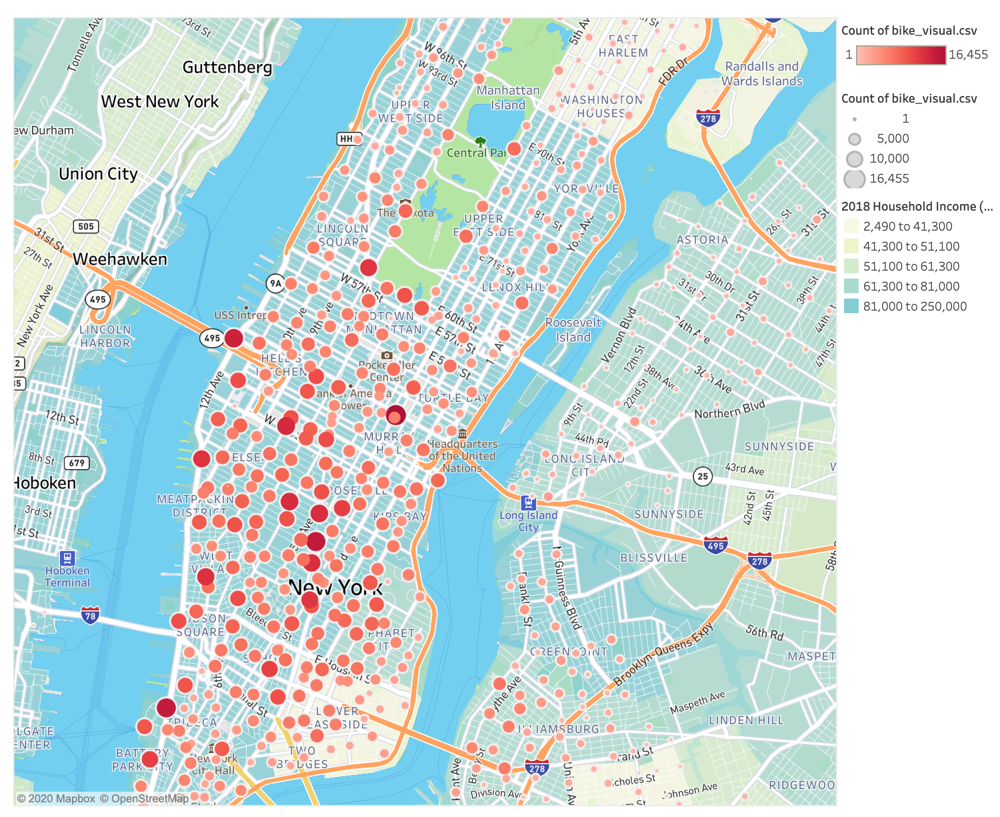

# Bikesharing. 

[NYC CitiBike business proposal](https://public.tableau.com/profile/raquel1027#!/vizhome/bike_challenge/Story1?publish=yes)
## Overview of the statistical analysis:

The purpose of this analysis is to look at trends and key data points from the August bike rentals data set of NYC CitiBike to determine factors that can contribute to the success of a similar business model in Des Moines. We looked at Gender, Usertype, and location as the main factors that contribute to success and provide a path for further analysis. 

Tools used
- Tableau for visualizations
- Jupyter notebook for data cleaning
- Pandas for data conversions

## Results:

<b>Dashboard:</b>
First is a dashboard showing the usage of bikes in NYC within three visualizations. Starting at the top left we see a pie graph showing the usertype totals; Subscriber which is someone who has an account the the Citibike app and pays on a recurring basis and Customer which is someone that uses bikes for a one type trip.

The next visualization, in the top right corner, is the Number of Trips for the month of August which totaled 2,344,224.

The final visualization is a Bike Utilization circle plot. The size of each circle relates to how often it is used.  

<b>Checkout Times:</b>
The graph has number of checkout bikes (number of trips) on the y-axis and trip durations on the x-axis. X-axis is divided into hours (at the top) and minutes (at the bottom). There is also a filter option for hours on the right panel. Most trip durations last between from 3 to 9 hours. 

<b>Checkout Times by Gender:</b>
This graph is similar to the first except it also shows gender information collected as it pertains to the number of checkout bikes (number of trips) on the y-axis and and trip duration in minutes and hours on the bottom and top, respectively.  In the right panel there are the filter options for hours as we show before but also a legend showing what each color represents. In this graph Orange represents male, blue represents female and red represents the unknown gender. Looking at the graph, the amount of checked out bikes for males is much higher than for female or unknown gender. Starting at the 1 hour mark, males checkout bikes at a much higher rate and continue until the 21 hour trip duration mark. 

<b>Trips by Weekday per Hour:</b>
This graph shows the total number of trips by weekday and hour. The more trips that are accounted for the deeper the color is shown on the orange-red color spectrum with red being higher count and yellow being lower count. We can see that the highest demand times are the morning hours on weekdays from 6am till 9am and in the evening hours on weekdays between 5 pm and 7 pm. Whereas the weekend high demand hours are middle of the day between 10 am and 6 pm. 

<b>Trip by Gender and Weekday:</b>
Similar to the last graph we see the high demand times by gender during the days of the week and by hour of the day. The colors represent the say data as well. We can see the same trends however we can also see that males are renting more at the high demand times versus females and others. It is also interesting to note that Thursday is the most popular day for bike rentals among male and females whereas others most popular days are Saturday and Sunday. 
 

<b>User Types by gender and usage by weekday:</b>
The graph shows the number of trips by weekday, by user type, subscribers versus  customers, and by gender. In the subscriber category, males have the highest number of the trips or utilization with the most popular days being Thursday, Friday, Tuesday, then Monday. Females also show the same trends but have lower utilization. The other gender category has the lowest rentals during the week, especially in the subscriber category but show more usage as customers on Saturday and Sunday.  

<b>Top starting Location:</b>
Next is a map of the starting locations of each rental. The larger the circle the more times that was a starting location for a bike rental. There is a map layer added that shows the number of housing units. The darker the color the more units there are. We can see that there are between 3,610,000 and 14,100,000 housing units in the areas were the most rental starting locations are. 

<b>Top End Locations:</b>
Similarly the last map shows the end locations of each rental. The larger the circle the more times that was logged as the end location for a bike rental. There is a map layer added that shows the income per household. The darker the color the higher income is in that area. We can see that most rental ending locations are in areas where the income is between $81,000 and $250,000 per year. 

## Summary:
Overall, we can see that bike rentals in August of 2019 were quite popular with over 2 million rentals in one month and the majority of the rentals occurring during the weekday around normal work and school commute times. This is an important distinction because this need for transportation during predictable times translates to predictable usage and revenue.
It is also interesting to note that the user demographic is largely subscriber based, meaning loyal customers. There is a substantial amount of one time users which provides the opportunity for them to convert to subscribers. Also, the demographic largely are male users, which provides a better understanding of target user types for marketing and product features in the future. Lastly, we now know a couple key selling points for our users: they live and work in the same downtown manhattan area, and their income is high for the area. 

For future analysis I would suggest drilling down into the cost of each trip, from here we can see a full picture of what contributes to checkout duration trends. I would display this similar to the trip duration graph but replace the number of bikes rented with the amount paid.
I would also suggest looking into other modes of transportation routes and stations to see how that affects the usage of bike rentals each day of the week. I would compare this in a heat map and use the top two competitors instead of looking at genders.
